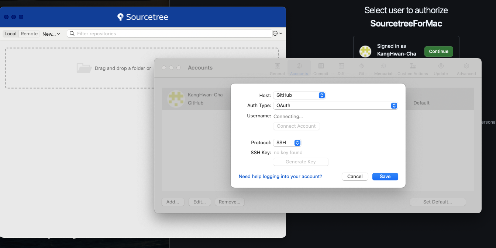
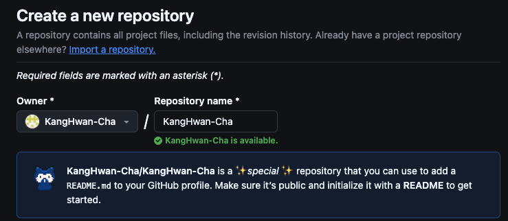

<!-- *NOTE* for writting up markdown -->
<!-- 
  ## => chapter
  ### => section in chapter

1. => section number in section

★ : Importance
-->

--- 
# Git, GitHub
---

<br>

> [터미널 명령 참조](https://github.com/0nn0/terminal-mac-cheatsheet/blob/master/한국어/README.markdown "Go to https://github.com/0nn0/terminal-mac-cheatsheet/blob/master/한국어/README.markdown")

## Table of Contents
- [Git, GitHub](#git-github)
  - [Table of Contents](#table-of-contents)
  - [Chapter 0 : 빠른 실습으로 Git, GitHub 감 익히기](#chapter-0--빠른-실습으로-git-github-감-익히기)
    - [로컬저장소에서 커밋 관리하기](#로컬저장소에서-커밋-관리하기)
    - [다른 커밋으로 시간여행하기](#다른-커밋으로-시간여행하기)
    - [GitHub 원격 저장소에 커밋 올리기](#github-원격-저장소에-커밋-올리기)
    - [GitHub 원격 저장소의 커밋을 로컬 저장소에 내려받기](#github-원격-저장소의-커밋을-로컬-저장소에-내려받기)
    - [단어정리](#단어정리)
  - [Chapter 1 : GUI를 위한 버전 관리 환경 구축하기](#chapter-1--gui를-위한-버전-관리-환경-구축하기)
    - [소스트리 설치하기](#소스트리-설치하기)
    - [비주얼 스튜디오 코드 설치하기](#비주얼-스튜디오-코드-설치하기)
    - [GitHub 둘러보기](#github-둘러보기)
  - [Chapter 2 ~ Chapter 3 : GIT GUI With. SourceTree](#chapter-2--chapter-3--git-gui-with-sourcetree)
  - [Chapter 4 : 둘 이상의 원격 저장소로 협업하기](#chapter-4--둘-이상의-원격-저장소로-협업하기)
  - [Chapter 5 : 실무 사례와 함께 Git 다루기](#chapter-5--실무-사례와-함께-git-다루기)
  - [Chapter 6 : GitHub 100% 활용하기](#chapter-6--github-100-활용하기)
  - [Chapter 7 : CLI 환경에서 Git 명령어 살펴보기](#chapter-7--cli-환경에서-git-명령어-살펴보기)


## Chapter 0 : 빠른 실습으로 Git, GitHub 감 익히기
###  로컬저장소에서 커밋 관리하기
1. 로컬 저장소 만들기
    ```bash
    $ git init
    ```

    **<u>Output</u>**
    ```
    Initialized empty Git repository in {path}
    ```
    

2. 첫번째 커밋 만들기
    1. 정보 등록
        ```bash
        $ git config --global user.email "star2kis@nate.com"
        $ git config --global user.name "KangHwan-Cha"
        ```

    2. 파일 추가
        ```bash
        $ git add README.md
        또는 
        $ git add .
        ```

    3. 커밋하기
        ```bash
        $ git commit -m "My first commit"
        ```

### 다른 커밋으로 시간여행하기
1. `git log`: 커밋 확인
    - git log 명령은 최신 커밋부터 보여줌
2. `git checkout {커밋 ID}`
3. `git checkout -`: 최근에 있던 브랜치로 이동

<br>

> 최근 `switch` / `restore`명령어로 나누어짐
> 1. **`switch`**: 브랜치 간 이동
> 2. **`restore`**: 커밋에서 파일들을 복구

### GitHub 원격 저장소에 커밋 올리기

1. 레포지토리: 원격 저장소
2. 원격저장소 만들기
    > [Git 레포지토리](https://github.com/KangHwan-Cha?tab=repositories "Go to https://github.com/KangHwan-Cha?tab=repositories")
3. 원격 저장소 url: https://github.com/KangHwan-Cha/Study_Git.git

4. ★ **원격 저장소에 커밋 올리기**
    ```bash
    # 원격 저장소 주소 입력
    $ git remote add origin https://github.com/KangHwan-Cha/Study_Git.git
    # 브랜치 만들기
    $ git branch -M main
    # 원격 저장소에 올리기
    $ git push origin main
    ```

### GitHub 원격 저장소의 커밋을 로컬 저장소에 내려받기
1. 클론<sup>clone</sup>: 코드와 버전 전체를 내려받기
    > [Download ZIP] 으로 받으면 원격 저장소와 버전정보가 제외되므로 `git clone`을 사용
    
    ```bash
    # 주소 뒤에 한칸 띄고 마침표
    # 마침표를 붙이면 현재 위치에 clone
    $ git clone {원격 저장소 주소} .  
    ```

2. 원격 저장소의 새로운 커밋을 로컬 저장소에 갱신하기
    
    ```bash
    $ git pull origin main
    ```


### 단어정리

- **Git**: 분산 버전 관리 시스템으로, <u>파일 변경 이력 관리</u> 및 협업을 위한 도구.
- **GitHub**: Git을 기반으로 한 웹 서비스로, <u>소스 코드 호스팅</u> 및 협업 기능을 제공.
- **GUI** <sup>Graphical User Interface</sup> : 그래픽 사용자 인터페이스로, 명령어 대신 그래픽 요소로 시스템과 상호작용하는 방식.
- **CLI** <sup>Command Line Interface</sup>: 명령어를 입력해 시스템과 상호작용하는 텍스트 기반 인터페이스.
- **Git Bash**: Git을 명령어 기반으로 사용할 수 있게 해주는 터미널 프로그램. Git과 Bash 쉘을 지원.
- **commit**: Git에서 파일의 변경 사항을 저장하는 단위. 각 커밋은 고유한 ID를 가짐.
- **log**: Git에서 커밋 이력을 확인할 수 있는 명령어. `git log` 명령어를 사용해 커밋 내역을 볼 수 있음.
- **checkout**: 특정 브랜치나 커밋으로 작업 공간을 변경하는 Git 명령어. `git checkout <브랜치명>`으로 사용.
- **워킹트리**<sup>working tree</sup>: 작업폴더 [.git]폴더를 뺀 나머지 부분이 워킹트리.
- **로컬 저장소**: 사용자의 컴퓨터에 저장된 Git 레포지토리로, 소스 코드와 이력을 포함. [.git]폴더가 로컬 저장소
- **원격 저장소**: GitHub, GitLab 등 외부 서버에 호스팅된 Git 레포지토리로, 협업을 위한 공유 공간.
- **repository**: 프로젝트의 소스 코드 및 변경 이력을 저장하는 Git 저장소. 로컬과 원격 저장소가 있음.
- **push**: 로컬 저장소의 변경 사항을 원격 저장소로 전송하는 Git 명령어. `git push`를 사용.
- **pull**: 원격 저장소에서 변경 사항을 로컬 저장소로 가져오는 Git 명령어. `git pull`을 사용.

## Chapter 1 : GUI를 위한 버전 관리 환경 구축하기
### 소스트리 설치하기
1. Sourcetree([Click](https://www.sourcetreeapp.com "Go to https://www.sourcetreeapp.com"))

<p style="text-align: center;">
    
</p>

### 비주얼 스튜디오 코드 설치하기
> 이미 사용하고있으므로 Pass

### GitHub 둘러보기
> 책 참조

## Chapter 2 ~ Chapter 3 : GIT GUI <sub>With. SourceTree</sub>
- 브랜치 : 줄기를 나누어 작업할 수 있는 기능
- HEAD : 브랜치 혹은 커밋을 가리키는 <u>포인터</u>
- 브랜치 작성 순서
    1. 브랜치 생성
    2. 생성된 브랜치 이동
    3. 브랜치에서 커밋
    4. 코딩이 완료되면 브랜치 병합
    5. 개발 완료된 브랜치 삭제

    > - 보통 하나의 개발 브랜치에는 <u>**한 사람만 작업**</u>해서 올리는 것이 바람직
    > - 원격 저장소에는 미리 브랜치 규칙을 정하는 것이 일반적
    >   - 규칙 예시
    >       1. `main` 브랜치에는 <u>직접 커밋을 올리지 않는다</u> (동시에 작업하다 꼬일 수 있으니).
    >       2. 기능 개발을 하기 전에 <u>`main` 브랜치를 기준으로 새로운 브랜치</u> 를 만든다.
    >       3. 이 브랜치 이름은 <u>`feature/기능이름` 형식</u> 으로 하고 한 명만 커밋을 올린다.
    >       4. `feature/기능이름` 브랜치에서 기능 개발이 끝나면 <u>`main` 브랜치에 이를 합친다.</u>
    >

- 병합 커밋 <sup>merge commit</sup>
- 빨리 감기 <sup>fast-forward</sup>
- 충돌 <sup>conflict</sup>
- 풀 리퀘스트<sup>pull request</sup> : 브랜치를 합치는 예의 바른 방법
    - 협력자에게 브랜치 병합을 요청하는 메시지를 보내는 것
    - 1. 수락 <sup>Accept</sup>
    - 2. 수정 요청 <sup>Request change</sup>
    - 3. 병합 <sup>Merge pull request</sup>
    - 패치(Fetch) : Git에서 새로운 이력을 업데이트
        > `Pull`: 실제 코드를 내려 받음
        > `Fetch`: 그래프만 업데이트

- 릴리즈 : 개발이 완료되었습니다. 출시하자!
    - 프로그램을 출시하는 것
    - 참고 - LTS(Long Time Support) 일반적인 버전보다 장기간에 걸쳐 지원하도록 특별히 만들어진 버전

    - **VERSION** 
        - ver 1<sup>a)</sup> .0<sup>b)</sup>.0<sup>c)</sup>
            a) : Major - 사용자들이 크게 느낄 변화
            b) : Minor - 작은 변화 등
            c) : Maintenance - 버그나 유지 보수 등 작은 수정
    
    - **태그**: 특정 커밋에 포스트잇 붙이기

## Chapter 4 : 둘 이상의 원격 저장소로 협업하기
- **포크**<sup>fork</sup> : 다른 사람의 원격 저장소를 내 계정의 원격 저장소로 복사해 오는 것
    | 명령   | 의의                                     | 편리한 점                                                                          | 불편한 점                                               |
    | ------ | ---------------------------------------- | ---------------------------------------------------------------------------------- | ------------------------------------------------------- |
    | 브랜치 | 하나의 원본 저장소에서 분기를 나눈다.    | 하나의 원본 저장소에서 코드 커밋 이력을 편하게 볼 수 있다                          | 다수의 사용자가 다수의 브랜치를 만들면 관리하기 힘들다. |
    | 포크   | 여러 원격 저장소를 만들어 분기는 나눈다. | 원본 저장소에 영향을 미치지 않으므로 원격 저장소에서 마음껏 코드를 수정할 수 있다. | 원본 저장소의 이력을 보려면 따로 주소를 추가해야 한다.  |

- **리베이스**<sup>rebase</sup> : 묵은 커밋을 새 커밋으로 이력 조작하기
    > - 커밋의 베이스를 똑 떼서 다른 곳으로 붙이는 것
    > - ★ 다른 개발자가 이 변경 사항을 사용하고 있지 않아야 함
    > - *히스토리를 강제로 조작하기 때문에 완전히 꼬일 수 있음*

    - **upstream** : 원본 저장소를 지칭하는 관용적 닉네임
    - **패치**<sup>fetch</sup> : 원본 저장소에 있는 커밋 히스토리를 받아오는 것 

## Chapter 5 : 실무 사례와 함께 Git 다루기

- **어멘드**<sup>amend</sup> : 수정 못한 파일이 있어요, 방금 만든 커밋에 추가하고 싶어요
    - `amend last commit`

- 원격 저장소의 마지막 커밋 수정하고 강제 푸시하기
    - 마지막 커밋 수정 후 
    - 강제 푸시
        ```bash
        $ git push origin main --force
        ```

- **체리 픽**<sup>cherry-pick</sup> : 저 커밋 하나만 떼서 지금 브랜치에 붙이고 싶어요
    > <u>문제가 발생한 커밋만 바로 수정</u>

    - 브랜치 전략 예시
        |   브랜치명    | 특징                                                                                                                                                     |
        | :-----------: | -------------------------------------------------------------------------------------------------------------------------------------------------------- |
        | feat/기능이름 | - 각 개발자가 개발 중인 브랜치<br> - 직접 커밋을 올림                                                                                                    |
        |     main      | - [feat/기능이름] 브랜치에서 개발 완료된 코드가 합쳐진 브랜치 <br> - 출시 전의 베타 버전 <br> - 집적 커밋을 올리지 않음(병합을 통해서만 코드를 업데이트) |
        |    latest     | - 실제 출시할 코드(대중에게 보여줄 완벽한 코드)를 올리는 브랜치 <br> - [main] 브랜치에서 굵직한 개발이 끝나면 출시 시점에 [latest] 브랜치로 코드를 병합  |

- **리셋**<sup>reset</sup> : 옛날 커밋으로 브랜치를 되돌리고 싶어요
    > 이전 커밋으로 상태 되돌리기
    1. `Mixed` 모드 : 원하는 커밋으로 브랜치를 되돌리면서도 변경 사항은 커밋하기 전 상태
    2. `Soft` 모드 : 변경 사항을 스테이지에 두어 **다시 당장 커밋이 가능**
    3. `Hard` 모드 : 이력을 깔끔하게 과거로 되돌림
<br>

- ★ **리버트**<sup>revert</sup> : 이 커밋의 변경 사항을 되돌리고 싶어요
    > 새로운 커밋을 추가해 커밋을 되돌리는 것
    
    - 잘못된 커밋이 있다면 언제든지 리버트 기능으로 돌리기!
<br>

- ★ **스태시**<sup>stash</sup> : 변경 사항을 잠시 다른 곳에 저장하고 싶어요, 커밋은 안 만들래요
    > - 커밋하기 전 파일을 임시로 저장
    > - <u>스태시에는 tracked 상태(추적중 - 한 번이라도 Git에 올렸던 상태)인 파일만 가능</u>

## Chapter 6 : GitHub 100% 활용하기
[GitHub의 계정 및 프로필 가이드](https://docs.github.com/en/account-and-profile "Go to https://docs.github.com/en/account-and-profile")

- REAME 꾸미기 기능
    - 깃 아이디로 레포지토리 생성
    <p style="text-align: center;">
        
    </p>

    - 나의 레포지토리의 readme에 마크다운 문법으로 업데이트
    - `your prifile`에 들어가면 업데이트를 확인할 수 있음
    - Curr Issue : 뱃지<sup>Badge</sup> 붙이기
        - [Shields.io](https://shields.io "Go to https://shields.io") 활용

- 더 좋은 풀 리퀘스트 만들기
    - 1. 의미를 담은 제목 짓기
        > [Conventional commits](https://www.conventionalcommits.org/ko/v1.0.0/ "Go to https://www.conventionalcommits.org/ko/v1.0.0/") 참조

        |   분류   | 의미                                                                                     |
        | :------: | :--------------------------------------------------------------------------------------- |
        |   feat   | 새로운 기능을 구현했을 때(서비스의 기능이 수정되는 것이라면 모두 포함, 문구 수정도 포함) |
        |   fix    | 기능에는 수정 사항이 없고 버그가 수정되었을 때                                           |
        |   perf   | 서비스나 라이브러리의 성능을 개선했을때                                                  |
        | refactor | 기능 추가도 없고, 버그 수정도 없는 단순 리팩터링                                         |
        |   test   | 테스트를 추가하거나 기존에 있는 테스트를 수정했을 때                                     |
        |  build   | 빌드 시스템이나 npm 배포에 대한 수정                                                     |
        |    ci    | CI 설정이 수정되었을 때(Jenkins, Travis 등)                                              |
        |  chore   | 그 외 실제 코드에는 영향이 없는 단순 수정                                                |

    - 2. 풀 리퀘스트를 병합하는 세 가지 방법
        - 1. 병합 커밋 생성<sup>Create a merge commit</sup>
        - 2. 스쿼시해서 병합<sup>Squash and merge</sup>
            > 히스토리가 한줄로 남는다는 장점이 있음
        - 3. 리베이스해서 병합<sup>Rebase and merge</sup>

## Chapter 7 : CLI 환경에서 Git 명령어 살펴보기
- 용어정리
    - **워킹트리** : 일반적인 작업이 일어나는 곳
    - **로컬 저장소** : .git 폴더, 커밋은 로컬 저장소에 저장
    - **원격 저장소** : GitHub 저장소, 로컬 저장소를 업로드하는 곳
    - **Git 저장소** : 엄밀하게는 로컬 저장소, 넓은 의미로 작업 폴더(워킹트리 + 로컬저장소)를 의미하기도 함
<br>

- CLI 명령어(기본)

    | Command | Description          |
    | :-----: | -------------------- |
    |   pwd   | 현재 경로 출력       |
    |  ls -a  | 숨김까지 리스트 출력 |
    |  mkdir  | 폴더 생성            |

- CLI 명령어(Git)
    > \<something> : 필수인자
    > [something] : 옵션인자

    | Command                                        | Description                                             |
    | ---------------------------------------------- | ------------------------------------------------------- |
    | status -s                                      | 짧게 요약해서 알려줌                                    |
    | git commit -a                                  | add 명령어 생략, untracked 파일은 커밋되지 않음         |
    | git push [-u] [원격 저장소 별명] [브랜치 이름] | 원격 저장소 업로드, -u 옵션으로 브랜치의 업스트림 등록  |
    | git pull                                       | git fetch + git merge                                   |
    | git fetch [원격 저장소 별명] [브랜치 이름]     | 로컬 저장소와 동기화                                    |
    | git merge <대상 브랜치>                        | 지정한 브랜치의 커밋들을 현재 브랜치 및 워킹트리에 반영 |
    | git reset [파일명] ...                         | 언스테이징 (mixed, soft, hard)                          |
    | git log -n<숫자>                               | 최신 n개의 커밋만 살펴봄                                |
    | git help <명령어>                              | 해당 명령어의 도움말을 표시                             |
    |                                                |                                                         |

- Git 저장소 초기화하기
    ```bash
    $ git init -b main # main 브랜치 초기화 및 git 저장소 생성
    $ git config --global user.name <이름>
    $ git config --global user.name  # 설정된 이름 확인
    $ git config core.editor  # 설정된 기본 에디터 확인
    $ git config --global user.email
    $ git config --global color.ui auto  # Git Bash 창의 Git 컬러가 자동으로 설정
    ```

- Git 명령어 옵션 설정
    | Command                                  | Description               |
    | :--------------------------------------- | ------------------------- |
    | git config --list                        | 현재 프로젝트의 모든 옵션 |
    | git config --global <옵션명>             | 지정한 옵션의 설정        |
    | git config --global <옵션명> <새로운 값> | 값을 새로 설정            |
    | git config --global --unset <옵션명>     | 옵션을 삭제               |

    > **우선순위**
    > local<sup>지역</sup> > global<sup>전역</sup> > system<sup>시스템</sup>


- 좋은 커밋 메시지의 7가지 규칙
    - 제목과 본문을 빈 행으로 구분합니다.
    - 제목을 50글자 이내로 제한합니다.
    - 제목의 첫 글자는 대문자로 작성합니다.
    - 제목에는 마침표를 넣지 않습니다.
    - 제목은 명령문으로(영어로 쓸 경우 동사원형(현재형)으로 시작)
    - 본문의 각 행은 72글자 내로 제한합니다.
    - 어떻게보다는 무엇과 왜를 설명합니다.